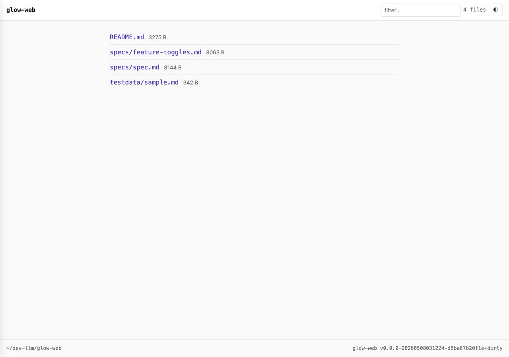
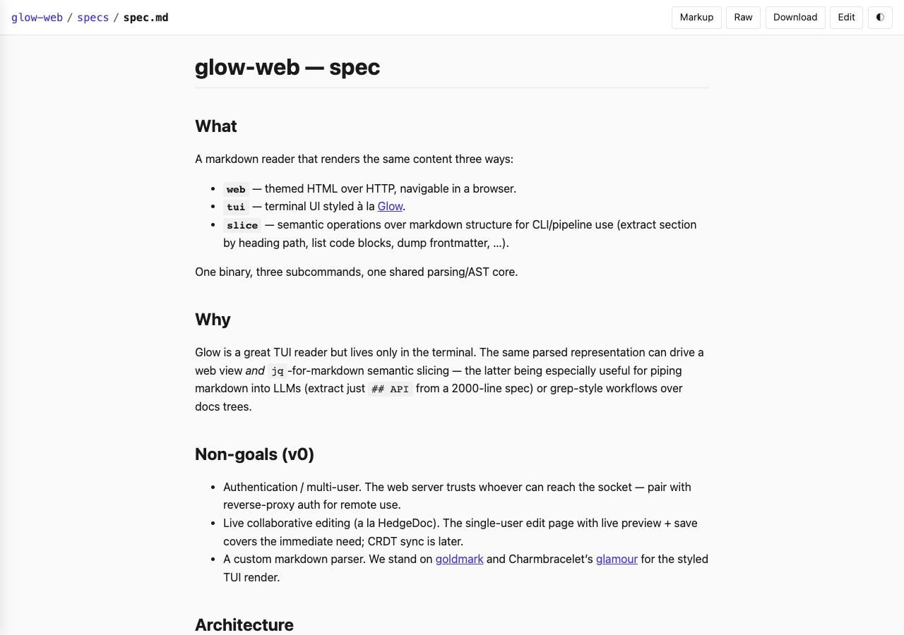
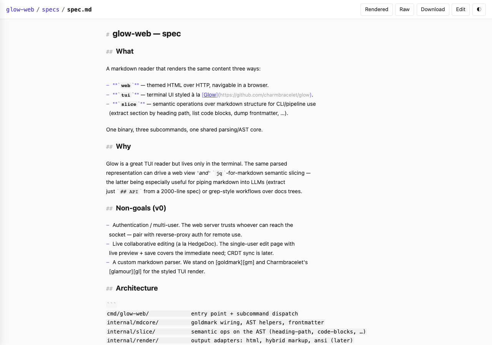
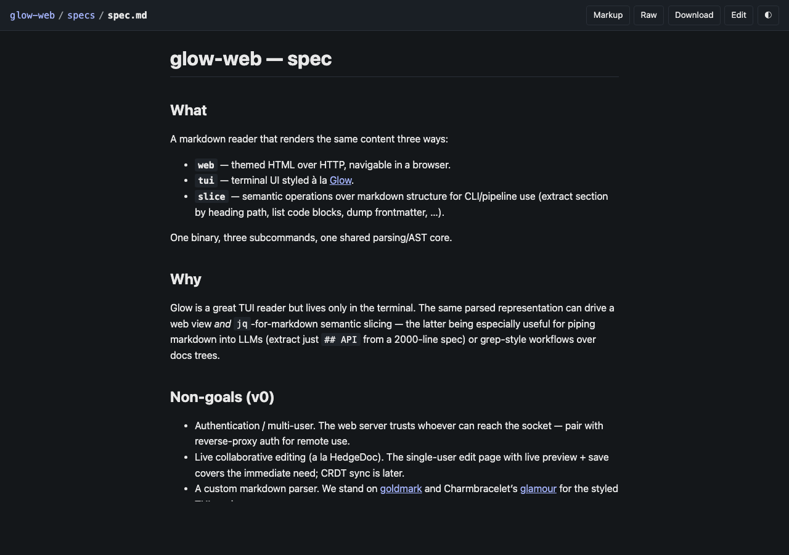
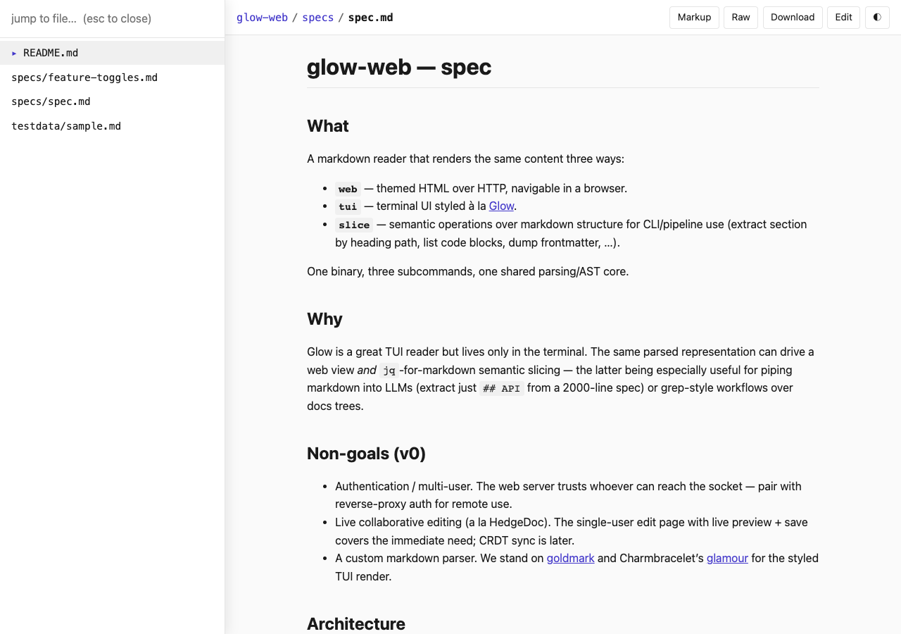

# glow-web

Markdown reader: web, TUI, and CLI semantic slicing — one binary, one AST.

Inspired by [Glow](https://github.com/charmbracelet/glow), Charmbracelet's
TUI markdown reader. glow-web extends the same idea to a browser, with
gitignore-aware directory serving, click-navigable breadcrumbs, intra-project
link rewriting, a hybrid Obsidian-like markup view, an edit page with live
preview, and a `jq`-for-markdown CLI.

See [`specs/spec.md`](specs/spec.md) for vision, scope, and architecture.

## Screenshots

| Index (project file list with fuzzy filter) | Rendered view (light) |
| :---: | :---: |
|  |  |

| Hybrid markup view | Dark theme |
| :---: | :---: |
|  |  |

Persistent file sidebar (⌘K / Ctrl-K, sticks across page navigations):



The bar's `◐` button cycles auto → light → dark; the choice persists in
`localStorage` and overrides the system preference. The sidebar opens on
⌘K / Ctrl-K and stays pinned (close with Esc or another ⌘K) so you can
jump between files without re-summoning it. The viewer also remembers the
scroll position per file in `localStorage`, so coming back to a doc lands
where you left off (skipped when the URL has a `#anchor`).

## Install

```sh
# Install the latest commit on main into $GOBIN (or $GOPATH/bin)
go install github.com/mcint/glow-web/cmd/glow-web@latest

# Or build from a checkout
git clone https://github.com/mcint/glow-web && cd glow-web
go build -o glow-web ./cmd/glow-web
```

## Quick start

```sh
# Serve a directory at http://127.0.0.1:8080 (loopback only by default)
glow-web web .

# Serve a single file
glow-web web README.md

# Expose on the LAN
glow-web web . --addr :8080            # ":8080" = all interfaces
glow-web web . --addr 0.0.0.0:8080     # explicit form

# Reverse-proxy mount
glow-web web . --addr :8080 --url-prefix /docs

# Render to HTML on stdout
glow-web render README.md --format html

# Hybrid markup view to stdout (markers visible, content styled)
glow-web render specs/spec.md --format markup

# Extract a section by heading path
glow-web slice specs/spec.md --heading "Architecture"

# Print version
glow-web version
```

## Web flags

```
--addr 127.0.0.1:8080      loopback only by default; ":8080" or "0.0.0.0:8080" for LAN
--url-prefix /docs         mount under URL prefix for reverse-proxy use
--gitignore=true           honor .gitignore (dir mode)
--ignore-files .rgignore   comma-separated additional ignore-files
--readonly                 disable the edit page and save endpoint
--markup                   default to hybrid markup view
--palette=true             ⌘K / Ctrl-K command palette (default on)
--theme auto               auto | light | dark (browser toggle overrides)
```

## Status

v0 spike. See [`specs/spec.md`](specs/spec.md) for the planned surface and
[`specs/feature-toggles.md`](specs/feature-toggles.md) for the design memo
on how config will scale beyond per-flag bools.
